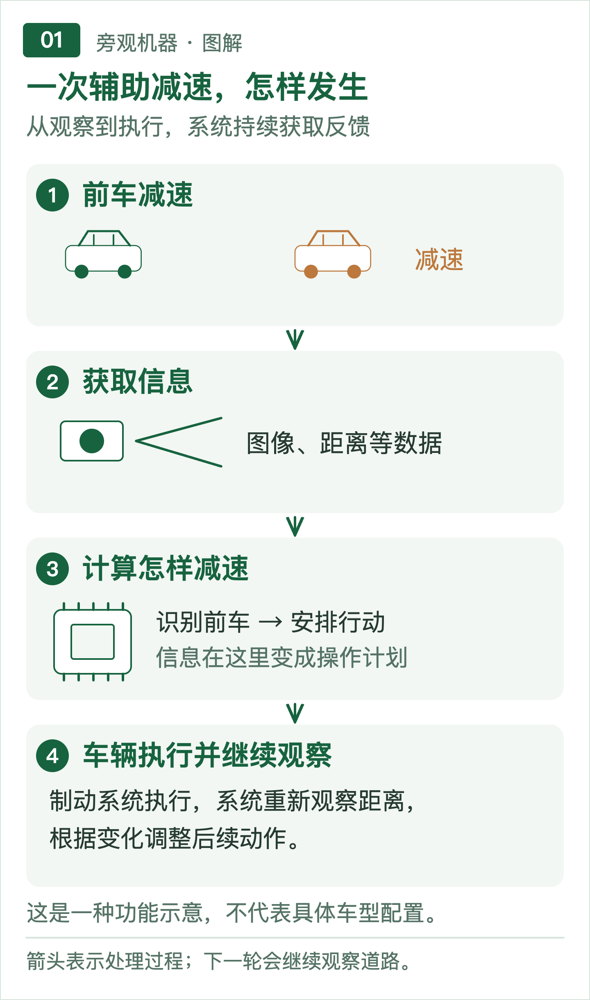
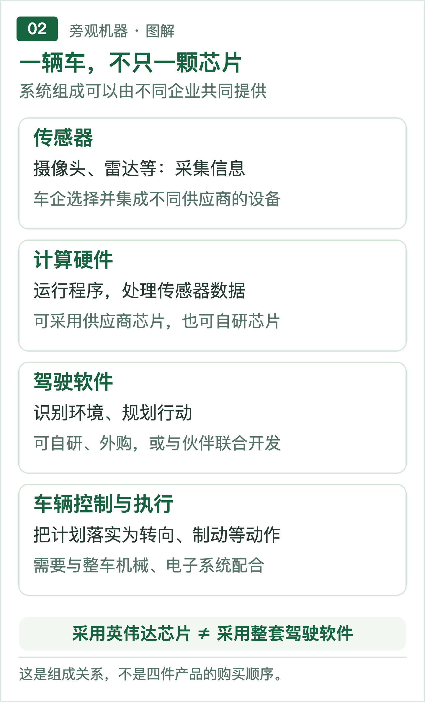
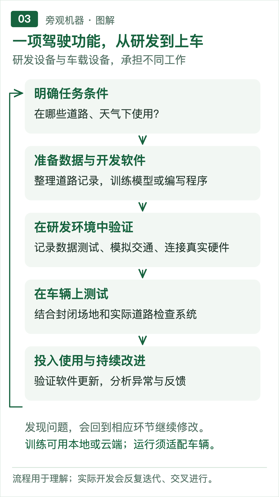
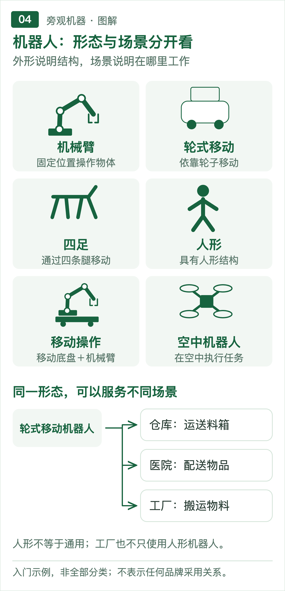
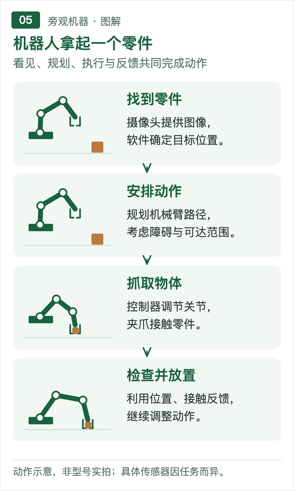
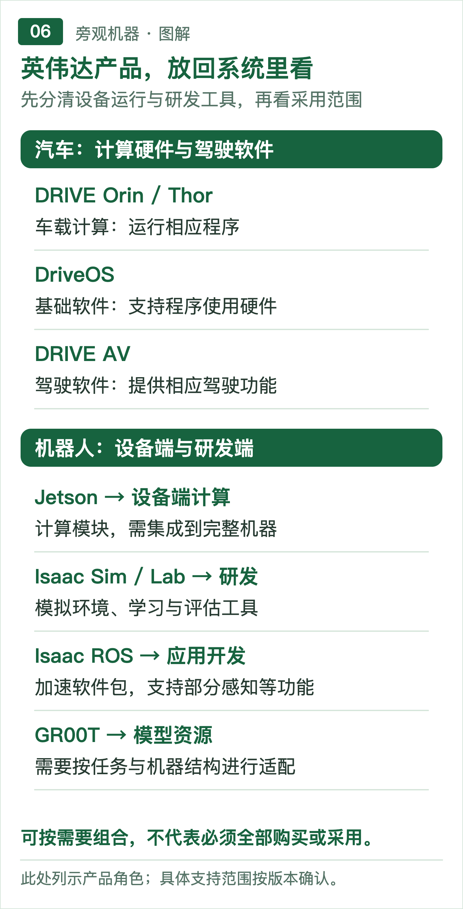

# 从汽车到机器人：英伟达的产品用在哪里？

候选标题｜图解阅读稿v3，待审核。资料核查截至2026年9月15日。

## 写作提纲（归档，不进入HTML正文）

- 开篇：从奔驰、比亚迪电子和宇树的公开采用记录，提出英伟达在不同项目中承担不同角色。
- 汽车：先认识车内系统及驾驶辅助的工作，再解释车企与供应商分工，沿研发过程介绍DRIVE的硬件与软件。
- 机器人：先交代类型和场景，再用搬运、抓取案例串起系统组成、研发测试及Jetson、Isaac的用途。
- 收束：技术合作的价值最终体现在实际任务中，采用芯片、使用开发工具与交付完整能力需要分开判断。

---

## 正文

**内容提要：英伟达在汽车与机器人行业的角色，已经延伸到计算硬件、开发软件和模型。但客户购买的组合各不相同：有的把芯片装进设备，有的使用仿真工具开展研发。看懂这些产品，需要先分清机器如何工作，以及哪些能力由整机厂商、软件开发者和供应商共同完成。**

奔驰介绍驾驶辅助功能时，提到了英伟达的计算平台和驾驶软件；比亚迪电子开发移动机器人，用到了英伟达的感知与仿真工具；宇树的公开开发项目中，也出现了英伟达的机器人学习软件。

这些合作听起来相似，实际发生在不同位置。奔驰的案例涉及车内运行的计算与软件，比亚迪电子和宇树的资料则展示了机器人研发工具的使用。仅凭一句“与英伟达合作”，还无法判断一辆车或一台机器人的技术组成。[1][2][3]

随着英伟达不断进入汽车、机器人等领域，产品名称也越来越多。理解它们的用途，可以从两个问题开始：机器怎样完成任务，企业又怎样把这种能力开发出来？

### 汽车：芯片之外，还有一整套驾驶系统

一辆车能够理解语音、播放导航，和它能否处理道路上的突发情况，是两类不同的能力。

前者主要属于座舱交互，后者涉及驾驶辅助。车辆还需要动力、底盘和车身控制，管理驱动、能量、转向、制动以及车门灯光等功能。这些工作可能分布在多个电子控制器中，也可能集中到更少的计算设备里。功能可以集中，责任仍要分清。

以跟随前车减速为例，车辆首先通过摄像头、雷达等传感器获取道路信息。传感器是测量外部环境或自身状态的设备；摄像头提供图像，雷达帮助测量距离和运动，部分车型还采用激光雷达获取空间信息。

软件随后识别前车、估计距离与速度变化，再决定需要怎样减速。识别环境称为“感知”，安排接下来的行动称为“规划”。最后，控制系统把结果转换成车辆能够执行的指令，并根据实际运动不断调整。

图1｜先看辅助减速的完整过程。

这一过程解释了为什么“用了什么芯片”只是问题的一部分。芯片承担计算，软件处理任务，车辆的机械和电子系统完成动作，任何一环都会影响结果。

图2｜硬件、软件和车辆执行，是不同的组成部分。

#### 车企选择不同的技术组合

在这套分工中，车企可以自研，也可以采购或联合开发，选择并不局限于整套购买。

特斯拉官方介绍了自行设计的车载AI计算机与推理芯片。问界M8采用的华为乾崑ADS，则是驾驶辅助系统方案的名称。比亚迪在2023年发布的公告中，明确介绍了扩大英伟达DRIVE Orin的使用范围。[4][5][6]

这些名称属于不同层级：芯片是计算部件，驾驶方案包含软件等能力，车企还要把它们整合进具体车辆。因此，不能把“华为ADS”和“Orin”直接当作两款同类芯片比较，也不能把某次合作扩大到一个品牌的所有车型。

车载计算也不等于把台式机显卡装进汽车。CPU，即中央处理器，承担通用程序和控制逻辑；GPU，即图形处理器，擅长并行完成大量计算，也被用于AI。一颗车载芯片可以集成多种计算单元及其他功能，这类芯片称为SoC，即系统级芯片。

英伟达的DRIVE Orin、Thor属于汽车计算产品。DRIVE AGX则提供相应的开发平台和套件，方便工程师连接传感器、运行软件和验证功能。进入量产车辆后，控制器的具体设计与配置仍取决于车企和供应商。[7]

DRIVE还有软件层。DriveOS提供程序运行所需的基础环境，帮助软件使用计算和传感器资源；DRIVE AV面向驾驶功能。采用英伟达芯片，并不意味着同时采用它的驾驶软件。[8]

奔驰提供了一个范围明确的例子。其2026年1月发布的MB.DRIVE ASSIST PRO介绍中，同时列出DRIVE AGX计算与DRIVE AV软件，并将功能定位为Level 2驾驶辅助。这意味着系统可以辅助转向和加减速，驾驶员仍需持续监督。[1][9]

蔚来早期ET7采用Orin支持的Adam计算平台，则是另一个已有交付记录的案例。两者都说明DRIVE已进入实际汽车产品，但不能据此认定合作范围完全相同。[10]

#### 车上的能力，在研发环境里反复打磨

芯片进入车辆之前，一项驾驶功能要经过更长的开发过程。

团队先要明确它服务什么条件：高速公路还是城市道路，适用于哪些天气，遇到超出能力的情况怎样处理。随后准备道路数据、开发软件，并通过实验检查系统的表现。

AI模型是其中的一种技术手段，可以理解为通过数据学习规律的计算程序。训练时，研发人员用数据调整模型内部的参数；运行时，模型处理新的道路输入，这个过程称为推理。近年来常见的“端到端”，是把部分原本分开的处理过程纳入共同学习的模型，但仍要与车辆控制和安全机制配合。

数据工作也不只是收集视频。团队需要筛选、整理，必要时为物体和事件添加说明，这称为标注；还要保留独立数据，检查模型面对未参与训练的情况时能否正确处理。

研发端可以使用服务器——持续提供计算、存储等服务的计算机。多台协同工作可组成集群，企业既可以自建，也可以租用云端资源。车载设备面对的约束则不同：空间、供电、散热有限，处理道路信息又必须足够及时。

因此，训练效率与车内响应速度不能混为一谈。模型在服务器上表现良好，还要验证移到车载硬件后，能否在需要的时间内给出结果。

仿真帮助团队重复检查这些问题。它用计算机模拟交通环境和系统反应，可以改变车辆位置、光照等条件，也可以连接真实车载计算机进行测试。之后仍需要结合封闭场地和实际道路验证；模拟环境不能覆盖全部现实情况。[11]

图3｜开发不是一次完成，测试结果会带来下一轮修改。

英伟达的汽车开发产品也延伸到这一侧，包括仿真和Alpamayo等模型资源。它们可以参与研发，但模型发布不等于某款车已经搭载，更不意味着下载后就获得完整驾驶系统。[12]

软件投入使用后，还要持续管理版本、调查异常和验证更新。OTA指通过无线网络更新软件，能够改进功能，但不能让已有硬件的能力无限增长。

### 机器人：先看任务，再看形态

汽车主要围绕道路行驶展开，机器人的任务则分散得多。

工厂机械臂焊接零件，仓库移动机器人运送料箱，家庭设备清洁地面，医疗机器人辅助操作——它们都属于机器人应用，但结构、工作条件和自主程度有很大差异。

行业常见工业、服务、医疗机器人等用途分类。另一种认识方式是看结构：固定机械臂、轮式或履带式移动设备、四足或双足机器人，以及把移动底盘与机械臂结合的移动操作机器人。空中和水下机器人还要应对不同的通信、能源与环境条件。[13]

这些分类可以交叉。人形机器人描述外形，家务机器人描述用途；一台轮式机器人可以在医院配送，也可以在工厂搬运。“通用”讨论的是能适应多大范围的任务，跑步、跳舞则展示动作能力，都不能直接代表全部工作能力。

机器人也不一定高度自主。有的执行预设程序，有的需要人远程操作，有的能在限定条件下自行完成任务。是否使用大模型，要看实际需求。

图4｜同一形态可以进入不同场景，分类之间存在交叉。

#### 搬运与抓取，需要不同的技术配合

仓库搬运是一个直观入口。机器人要知道自己在哪里、货物在哪里、路上有没有障碍，还要接收任务并到达指定位置。极智嘉的仓储方案展示了货物处理与移动机器人的实际用途；这一场景本身并不意味着采用某一家芯片或软件。[14]

如果任务进一步变成“把零件从料箱取出，放到工作台”，系统就要增加操作能力。

机械臂需要关节和电机，末端安装夹爪、吸盘等接触物品的工具，这些工具称为末端执行器。摄像头帮助识别零件，关节传感器反馈位置，力或触觉传感器可以帮助判断接触情况。

软件据此计算可行的动作路径，再由控制系统不断调整关节运动。前者称为运动规划，后者负责让实际动作接近期望结果。模型可以参与，但传统数学方法与控制程序同样重要。

图5｜用一次抓取看清机械、感知与控制的配合。

这意味着，换一颗更强的芯片不一定能解决抓取问题。夹爪是否适合物体，机械是否稳定，感知和控制是否准确，都需要一起判断。

整机厂商通常要把这些能力组合成产品；供应商提供部件和软件；集成商再帮助设备接入现场。工厂和仓库由此成为机器人的使用场景，而不是与机器人并列的另一种产品。

#### 英伟达既在设备里，也在开发工具里

Jetson是英伟达面向机器人等设备的计算产品家族，提供可集成到机器内部的模块。开发套件则把部分配套准备好，方便实验。无论模块还是套件，都不是带有机械结构和完整工作能力的成品机器人。[15]

选哪一种Jetson，需要结合软件、模型、传感器和功耗要求。内存用于暂存运行中的模型与数据，容量影响内容能否放下；延迟则表示系统收到输入到给出结果所需的时间。两者都重要，不能仅看一项峰值算力。

波士顿动力2025年的公告介绍，Atlas将Jetson Thor与自己的全身及操作控制器配合使用。这个案例显示了计算平台与整机能力的边界：英伟达参与计算，机器人厂商仍承担控制与产品开发。[16]

另一部分产品出现在研发人员的电脑和服务器中。

Isaac是一组机器人开发工具。Isaac Sim用于搭建模拟环境；Isaac Lab用于组织机器人学习和评估；Isaac ROS则提供加速软件包，帮助开发部分感知等功能。[17]

ROS的全称是Robot Operating System，通常译作机器人操作系统，但主要提供开发机器人应用的软件库和工具。ROS 2是其新一代体系，开发者可以借它连接不同程序模块；它本身并不是英伟达产品。[18]

Isaac Sim采用Omniverse相关技术。Omniverse提供三维场景、图像生成和仿真等开发能力，帮助构建用于观察和测试的环境。要让环境有用，还需配置物体质量、摩擦、传感器等条件，画面逼真只是其中一部分。[19]

比亚迪电子的合作发生在这一层。英伟达2024年公告介绍，其使用Isaac Sim和Isaac Perceptor开发自主移动机器人。Perceptor是面向移动机器人感知的参考开发流程，帮助利用摄像头信息理解周围空间。这是工具采用记录，不应被扩大为全部工厂已完成部署。[2]

宇树的官方Isaac Lab仿真项目也提供取放等模拟任务，支持数据收集和模型验证。它说明研发如何开展，但不能用模拟任务清单推断所有量产机器人的能力，更不能据此猜测机载芯片型号。[3]

图6｜把产品名称放回已经认识的系统位置。

#### 从实验动作到持续工作

开发一项取放能力，首先要确定物品材质、重量、摆放方式和操作速度。这些条件会影响机械和软件选择。

零件位置固定时，预先编程可能就能完成工作；面对杂乱物体，则可能需要更复杂的识别与规划。若采用学习方法，可以让模型从人的示范中学习，这称为模仿学习；也可以让它尝试动作、根据结果调整策略，称为强化学习。

在已有模型上继续调整，称为微调。英伟达GR00T就提供机器人模型及相关开发资源，具体模型可以根据图像、语言和机器人状态生成动作相关输出，但仍需要适配机器结构与任务。[20]

这类实验需要数据、开发软件、计算资源和测试环境。简单程序未必需要大型计算集群，复杂模型训练则可能需要更多资源，团队可以按需求自建或租用。

仿真能够减少实机试错：虚拟机器人可以反复尝试动作，不必每次消耗物料或冒着损坏设备的风险。但现实中的摩擦、物体软硬、光照和机械误差，与模拟条件往往不同。仿真中学会的动作，需要在实机上重新验证和调整。[21]

到了现场，问题还会扩大。前一道工序没送来物料怎么办，零件卡住怎么办，多台机器人如何分配任务，电量不足如何安排充电，都属于实际运行的一部分。

机器人研究者Ken Goldberg在访谈中强调，任务成功率和动作时间都影响实际吞吐量，也就是一定时间能完成多少工作。动作很快却频繁失败，或每次成功但耗时过长，都可能限制商业价值。[22]

由此看，英伟达的产品参与了机器人开发和运行的多个位置，但从一次演示走向稳定工作，仍需要机械、控制、现场集成和维护共同完成。

### 产品合作最终要落到具体能力

从汽车到机器人，英伟达的角色没有一个统一答案。

有的项目采用其计算硬件，有的使用开发软件，有的还采用模型资源。同一家公司也可以同时使用自己的技术、开源工具和其他供应商的产品。

真正有助于理解行业的信息，是合作发生在哪一层、针对什么任务，以及已经验证到什么程度。把这些关系分清，才能看懂一项功能的来源，也能判断一份产品公告距离实际应用还有哪些工作。

---

## 来源

[1] [奔驰：MB.DRIVE ASSIST PRO，2026年1月](https://group.mercedes-benz.com/technology/autonomous-driving/driving/mb-drive-assist-pro.html)

[2] [NVIDIA：比亚迪电子等采用Isaac，2024年6月](https://nvidianews.nvidia.com/news/robotics-industry-development-ai-autonomous-machines)

[3] [宇树官方Isaac Lab仿真项目](https://github.com/unitreerobotics/unitree_sim_isaaclab)

[4] [Tesla：AI与机器人研发](https://www.tesla.com/en_gb/AI)

[5] [问界M8官方产品页](https://hima.auto/wenjie/m8/)

[6] [比亚迪：扩大DRIVE Orin合作，2023年3月](https://www.byd.com/mea/news-list/BYD-Partners-With-NVIDIA-for-Mainstream-Software-Defined-Vehicles.html)

[7] [DRIVE AGX开发平台](https://developer.nvidia.com/drive/agx)

[8] [DriveOS](https://developer.nvidia.com/drive/os)

[9] [NHTSA：驾驶自动化级别](https://www.nhtsa.gov/vehicle-safety/automated-vehicle-safety)

[10] [蔚来ET7采用Orin并开始交付，2022年](https://blogs.nvidia.com/blog/nio-et7-drive-orin-arrives/)

[11] [NVIDIA自动驾驶安全报告](https://docs.nvidia.com/self-driving-cars/autonomous-driving-safety-report/index.html)、[车辆仿真](https://developer.nvidia.com/drive/simulation)

[12] [Alpamayo模型与开发资源](https://nvidianews.nvidia.com/news/alpamayo-autonomous-vehicle-development)

[13] [IFR工业机器人定义](https://ifr.org/industrial-robots)、[服务与医疗机器人分类](https://ifr.org/service-robots)

[14] [极智嘉仓储机器人方案](https://www.geekplus.com/en)

[15] [Jetson模块](https://developer.nvidia.com/embedded/jetson-modules)

[16] [波士顿动力：Jetson Thor与控制器，2025年3月](https://bostondynamics.com/news/boston-dynamics-expands-collaboration-with-nvidia/)

[17] [Isaac Sim](https://docs.isaacsim.omniverse.nvidia.com/latest/index.html)、[Isaac Lab](https://developer.nvidia.com/isaac/lab)、[Isaac ROS](https://developer.nvidia.com/isaac/ros)

[18] [ROS 2官方项目](https://github.com/ros2)

[19] [Omniverse](https://www.nvidia.com/en-us/omniverse/)

[20] [GR00T模型卡](https://huggingface.co/nvidia/GR00T-N1.7-3B)

[21] [机器人仿真与现实差距综述](https://arxiv.org/html/2510.20808v1)

[22] [AIhub：Ken Goldberg访谈，2026年9月](https://aihub.org/2026/09/01/combining-cultures-from-code-to-canvas-an-interview-with-ken-goldberg/)
