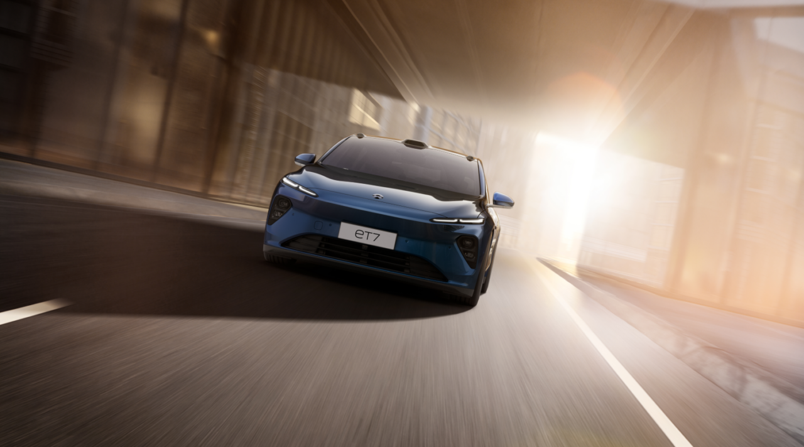
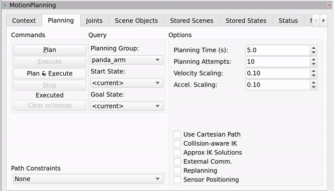
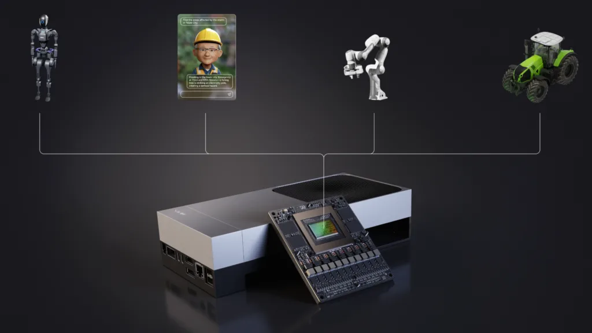
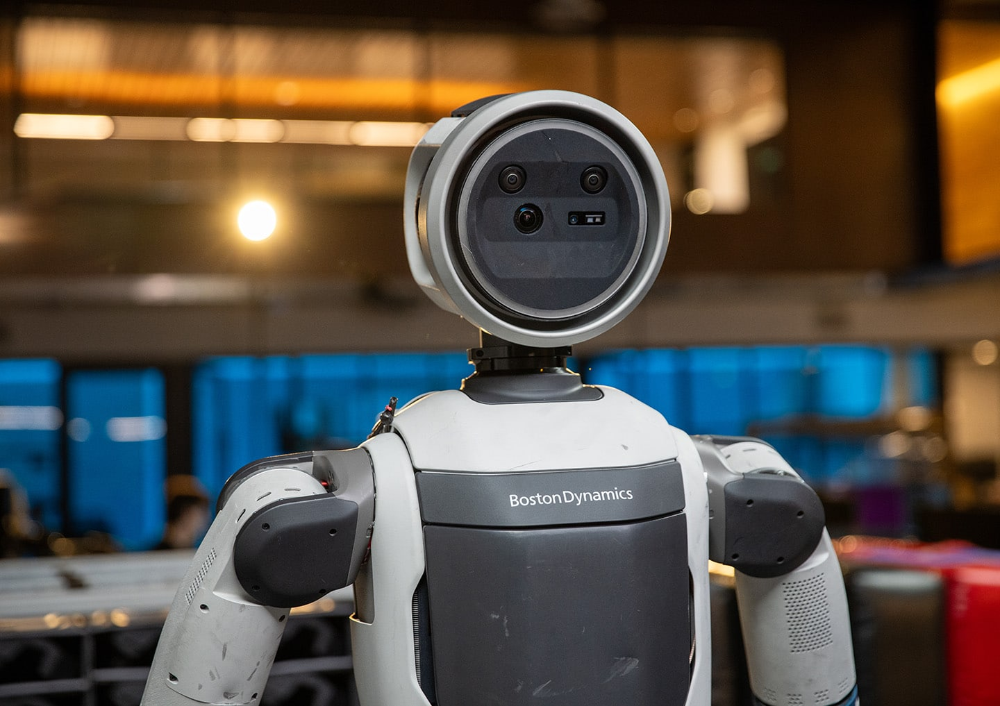
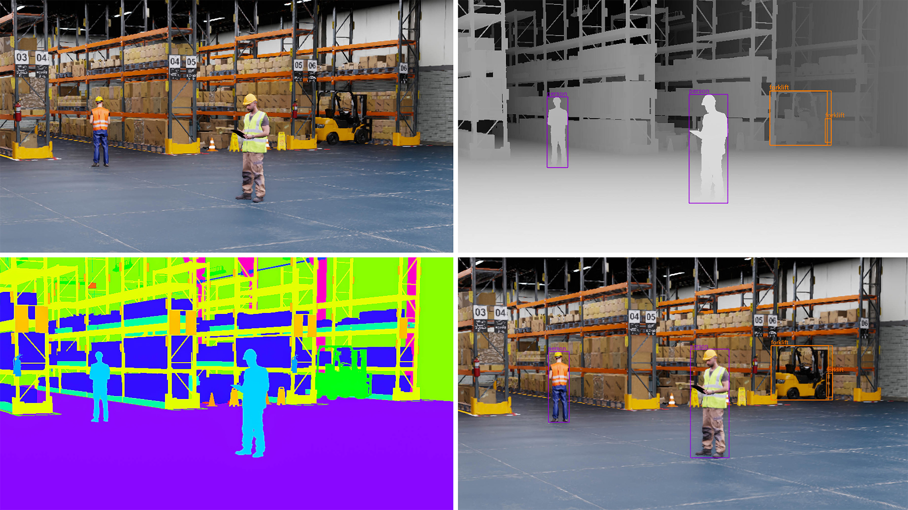

# 从汽车到机器人：英伟达的产品用在哪里？

候选标题｜图文修订稿v4，待审阅。核查日期：2026年9月15日。写作逻辑见outline-v4.md。

## 正文

**内容提要：汽车和机器人的智能，来自感知、计算、控制与机械系统的配合。英伟达提供其中的计算硬件，也提供处理传感器数据、开发模型、规划动作和模拟测试的软件。理解它的产品版图，要同时看设备怎样工作，以及这些能力怎样被开发出来。**

一辆汽车跟随前车减速，一台机械臂从料箱里拿起零件，看起来相隔很远，背后却有相似的技术问题：机器先要知道周围发生了什么，再决定怎样行动，最后把计算结果变成真实动作。

英伟达正在进入这些环节。它的名字出现在车载计算平台上，也出现在机器人的开发电脑里。前者让程序在设备上运行，后者帮助工程师把程序做出来。

这种差别，决定了“采用英伟达”究竟意味着什么。奔驰公开的驾驶辅助方案涉及计算平台与驾驶软件；宇树公开的机器人项目，则展示了仿真和开发工具的使用。两者都有明确依据，合作的内容却不同。[1][2]

## 汽车：从一次减速，看清技术分工

汽车里的智能系统并不只有驾驶辅助。语音交互、导航显示属于座舱功能；转向、制动和动力管理还涉及车辆自身的控制系统。本文重点讨论驾驶辅助，因为它最直接地连接了环境判断和车辆动作。

当前车减速时，摄像头等传感器先获取道路信息。**传感器就是测量环境或自身状态的设备**：摄像头记录图像，雷达测量距离和运动，部分车型还用激光雷达获取周围物体的空间信息。

车内计算设备运行软件，从这些数据中识别前车、估计车距，再计算怎样调整速度。识别环境叫感知，安排接下来的行动叫规划。控制系统随后把计划转成转向、制动等指令，并不断检查车辆实际运动是否符合预期。

因此，一项驾驶功能至少涉及几类不同的东西：获取信息的传感器、承担运算的计算硬件、处理任务的软件，以及执行动作的车辆系统。

**英伟达首先提供的是计算平台。** Orin和Thor是其汽车计算芯片产品；DRIVE AGX是围绕相应芯片构建的汽车计算平台，也有供工程师使用的开发套件。[3]

这种芯片不是台式机显卡的简单移植。它可以把CPU、GPU等功能集成在一起。CPU是Central Processing Unit，即中央处理器，负责通用程序等工作；GPU是Graphics Processing Unit，即图形处理器，也擅长并行处理AI所需的大量计算。把多个系统功能集成到一颗芯片上，称为SoC，System on a Chip，即系统级芯片。

研发人员可以用开发套件接入传感器、运行程序。真正装车时，还要把计算芯片、供电、散热、接口等做成适合车辆的控制器，并与整车连接。

### 同样采用英伟达，买的内容可以不同

蔚来早期ET7是一个已经交付的例子。2022年的资料显示，其Adam计算平台采用英伟达Orin，为蔚来的驾驶技术提供计算支持。[4]

奔驰的合作则进一步涉及驾驶软件。奔驰在2026年1月介绍MB.DRIVE ASSIST PRO时，同时列出了英伟达DRIVE AGX计算平台和DRIVE AV软件，并把功能定位为Level 2驾驶辅助。[1]

Level 2意味着系统可以辅助车辆转向和加减速，驾驶员仍需持续监督。功能名称里出现“自动”或采用了AI芯片，都不会改变这一责任划分。[5]

这两个案例揭示了英伟达汽车产品的不同层级：**车企可以采用它的计算硬件，也可以进一步采用驾驶软件，合作范围需要逐项确认。**

其中还有容易被忽略的一层：让驾驶软件使用硬件的基础工具。**DriveOS**提供操作系统及相关基础环境；**DriveWorks**是开发工具包，提供传感器数据接入、记录回放、图像处理等功能。[6][7]

例如，工程师需要把相机记录的数据交给后续识别程序。数据怎样读取、怎样记录以便复查，都是重复出现的开发任务。DriveWorks把其中一些功能做成现成工具，团队可以在此基础上继续开发。**DRIVE AV**则更接近用户最终体验到的驾驶功能，不能与这些基础工具混为一谈。

车企也有其他组合。特斯拉公开介绍过自研车载AI芯片；问界M8官方介绍的是华为乾崑ADS驾驶辅助方案；比亚迪2023年宣布扩大采用DRIVE Orin。[8][9][10] 自研芯片、外购计算平台、采用供应商驾驶方案，可以发生在不同层级；一条品牌合作新闻也不能代表该品牌每一款车。

### 车上的一次判断，背后是反复开发与测试

驾驶软件要识别前车，研发团队就需要教会或编写这种识别能力。对于采用AI的部分，常见做法是准备道路数据，训练模型，再检查它遇到新画面时的表现。

**模型可以理解为从数据中学习规律的计算程序。** 训练是用数据调整它内部的参数；部署后处理新的道路信息，称为推理。训练通常在研发电脑、服务器或云端完成，推理则需要适应车上的计算、供电和响应要求。

困难在于，道路视频多，不等于有效样本多。大量正常行驶片段可能重复，而突然横穿、遮挡或特殊光照等情况，需要单独查找和测试。

英伟达在这一侧也提供产品。**Cosmos Curator**用于筛选、整理和去除重复数据；**Alpamayo**提供面向驾驶研究与开发的模型资源。前者帮助准备材料，后者给团队一个继续训练和研究的基础。[11][12]

模型还需要在模拟环境中接受检验。仿真就是在电脑里构造道路、车辆和传感器，让程序面对可控制、可重复的条件。**Omniverse NuRec**可从记录的场景数据重建可交互环境；**AlpaSim**用于闭环仿真，也就是让软件作出动作后，模拟环境随之变化，再把新情况反馈给软件。[11]

回看一段视频，只能检查当时的画面会得到什么判断；闭环模拟还能检查：如果系统真的减速或转向，后面会发生什么。这是仿真比“播放测试录像”多做的一步。

团队仍需用真实车辆验证传感器、计算设备和车辆控制能否共同工作。模拟环境可以反复制造测试条件，真实测试则检验那些难以准确模拟的部分。[13]

**汽车业务里的英伟达，已经同时供应车内计算和研发工具。** 硬件进入量产车有交付证据，软件采用的深度却因项目而异。现有案例能证明它参与了哪些环节，不能直接换算成整个行业的采用率。

## 机器人：先分清它要做什么

机器人不等于人形机器人。工厂里焊接、搬运的机械臂，仓库里运送料箱的轮式机器人，以及用于巡检的四足机器人，都属于这个范围。

理解分类，可以先分开两条线：**用途说明它在哪里、做什么；形态说明它长什么样、怎样移动和操作。** 工业、物流、家政、医疗是用途；机械臂、轮式、四足、人形是形态。[14]

“家务机器人”描述任务，“人形机器人”描述结构，“通用机器人”则描述希望达到的能力。会跑步、跳舞，证明了某些运动或动作编排能力，却不能据此认定它能整理陌生家庭的杂物。后者还涉及识别物品、理解任务、操作不同材质，以及处理失败。

工厂与机器人当然存在交叉。对工厂而言，采购目标通常是搬运、抓取、装配等工序。机械臂可以固定在工位，移动机器人可以负责送料，二者组合后，也能让机器人移动到不同位置再操作物体。

这意味着，介绍英伟达的机器人产品，应该沿着任务往下看：机器要获得什么信息、作出什么计算，哪些工具能帮助开发这些能力。

### 抓起一个零件，需要几种不同的能力

以从料箱中取出零件为例。零件如果总在固定位置，机械臂可以按预先设定的动作工作。零件杂乱摆放时，程序就要根据现场情况重新判断。

第一步是找准目标。知道画面里“有一个零件”还不够，机器人还要知道它在哪里、朝哪个方向摆放，夹爪才能从合适的位置接近。

英伟达的**FoundationPose**是一种用于估计和跟踪物体位置、朝向的模型。这类位置与朝向信息合称“位姿”。其公开研究方案需要物体的三维模型，或少量参考图像等先验信息，帮助系统在新画面中辨认目标。[15]

它解决的是“零件怎么摆着”这一具体问题。夹爪应该夹哪里、机械臂怎样过去，还需要后续程序。

第二步是规划动作。机械臂不能直接穿过料箱边缘，也不能让自己的关节撞上工作台。程序需要结合机器人的结构、目标位置和周围障碍，计算能够执行的运动路径。

**cuMotion**是英伟达用于机器人运动规划的加速软件。官方参考方案把机器人结构、环境和目标位置交给规划程序，再把结果接入机器人执行系统。[16]

第三步才是实际抓取。控制器调节关节运动，电机带动机械臂，夹爪与零件接触。抓得住还要看夹具、摩擦和力度；零件滑落后，也需要检测失败并处理。

**从这个例子看，AI模型、运动规划和机械控制承担不同工作。** 找准零件、绕开障碍之后，接触和装配仍要依靠夹具与控制配合。英伟达提供的是可以嵌入整套系统的计算功能，机器人的机械设计与现场调试仍有独立价值。

这些工具可以通过**Isaac ROS**等开发资源接入项目。ROS全称Robot Operating System，通常译为机器人操作系统，主要提供连接机器人程序模块的库和工具；ROS 2是其新一代体系，并非英伟达产品。Isaac ROS是在此基础上提供的一组GPU加速软件包与模型。[17]

对于搬运机器人，问题还包括“自己在哪里”和“哪条路能走”。英伟达也提供相关工具，例如cuVSLAM用于视觉定位与建图，nvblox用于把传感器数据转换成障碍空间表示。[18] 它们服务移动任务，与抓取工具并列存在，并不是所有机器人都要安装的一套固定程序。

### Jetson装在哪里，和开发电脑有什么不同

上述程序需要计算设备运行。固定机械臂可以连接旁边的工业电脑；移动机器人则通常需要把足够的计算能力带在身上，处理不断变化的现场信息。

**Jetson是英伟达面向机器人等设备的嵌入式计算平台。** “嵌入式”是指计算设备作为部件装进另一台机器。Jetson模块集成处理器、内存等，机器人厂商还要为它配置连接接口的电路板、供电与散热，并接入自己的传感器和控制器。[19]

Jetson Orin与Jetson Thor属于不同代际的产品。配套的开发套件则把模块、接口等组合起来，便于工程师接设备、装软件和测试。**开发套件可以先用来做实验，量产模块则面向整机集成。**

Jetson的基础软件包叫**JetPack**，包含系统软件和开发工具，帮助应用使用计算硬件。[20] 团队既可以采用英伟达的机器人软件，也可以运行兼容的自研程序与其他工具。

波士顿动力2025年公布的Atlas合作说明了这种分工：Jetson Thor与其自身的全身控制、操作能力结合，合作还涉及Isaac Lab。[21] 整机厂商已有的运动控制技术，并没有因为采用新的计算平台而消失。

### 机器人的本领，在开发环境里练成

计算设备解决“程序在哪里运行”，研发工具解决“程序怎样做出来”。两者不是同一笔工作。

开发抓取能力时，团队先要确定零件、夹爪和作业条件，再准备机器人结构描述、相机数据与测试任务。如果使用学习方法，还需要动作示范或训练规则，以及检查效果的数据。

工程师可以先在电脑里搭建料箱、零件和机械臂。**Isaac Sim**就是英伟达的机器人仿真平台，使用Omniverse的相关技术构建虚拟环境。它既能模拟运动，也能生成带物体标注的图像，供识别程序训练和测试。[22]

图里的价值不只在于“像真的”。真实照片中的物体需要另行标注，而在虚拟场景中，程序知道哪些物体被摆在什么位置，可以一并输出训练所需的信息。改变物体摆放、光照等条件，还能生成不同样本。

**Isaac Lab**进一步组织机器人学习：让程序在模拟环境里尝试动作，记录结果，并据此更新控制策略。跟随人的示范学习，叫模仿学习；根据动作结果得到的奖励反复调整，叫强化学习。[23]

宇树公开的Isaac Lab项目提供取放等模拟任务和数据收集、验证流程，是中国企业使用这类研发工具的具体例子。[2] 比亚迪电子也在2024年的公开资料中被列为采用Isaac Sim和Isaac Perceptor开发自主移动机器人的企业；Perceptor对应移动机器人感知开发流程。[24] 这些证据说明研发采用，不能直接推成整家公司所有机器人都已装上英伟达硬件。

更完整的工作过程，可以在工业软件公司Intrinsic的案例里看到。它在2024年介绍，与英伟达测试机器人抓取技术，针对客户TRUMPF提出的工业应用制作原型，并使用Isaac Sim生成训练数据。[25]

**这项原型要减少的，是为特定零件反复编写抓取程序的工作。** 它展示了仿真数据与学习方法怎样接入工业开发，但并不是全部产线已经规模使用的证明。

对于希望从已有能力继续开发的团队，英伟达还提供**GR00T机器人模型**。这类模型把图像、任务指令和机器人状态等信息用于生成动作相关输出，团队再针对自己的机器和任务进行适配。[26] 它与Isaac Sim、Isaac Lab的区别是：前者提供可继续开发的模型能力，后两者提供模拟与学习环境。

因此，一家机器人企业可能在研发电脑上使用Isaac工具，在机器人上使用Jetson，也可能只采用其中一部分。开发环境与设备端共同构成产品版图，不能只数机器人身体里的芯片。

### 工厂需要的是持续工作，而不只是完成演示

仿真可以减少实机试错，但零件表面、摩擦和机器误差很难被完全还原。模拟中学会的动作，还要放到真实设备上测试；换一种包装、出现遮挡或夹取失败，也需要有后续处理。[27]

机器人研究者Ken Goldberg在2026年9月的访谈中指出，工业吞吐量同时取决于成功率和动作耗时。他也主张把传统控制方法与学习方法结合起来。[28]

这个判断直接影响产品评价：机器人一次拿得很准，如果动作太慢，仍可能拖慢工序；动作很快，如果经常要人处理失败，也难以稳定生产。

对工厂来说，最终交付物是能接上物料、完成工序、处理异常并接受维护的系统。机械臂、传感器、软件和计算设备，要围绕这个结果一起验证。英伟达工具的作用，应当落到少做了哪些重复开发、改善了哪个环节，而不能只由模型名称或演示动作来判断。

## 英伟达供应的，是机器运行与研发中的多个环节

沿着汽车和机器人各看一遍，产品关系就清楚了：DRIVE和Jetson提供设备端计算；DriveOS、DriveWorks和Isaac ROS帮助开发程序；FoundationPose、cuMotion等解决具体感知与动作问题；Isaac Sim、Isaac Lab、Cosmos及相关模型资源，又进入了研发和测试过程。

**这些产品的范围并不小，但它们并不等于一辆完整汽车或一台完整机器人。** 车企和机器人厂商需要把计算能力同机械、控制、数据与实际任务连接起来，决定最终能交付什么功能。

从产品布局看，英伟达正在争取的不只是设备里的一个计算位置，也包括工程师开发、训练和验证能力时使用的工具。硬件提供运行基础，软件让更多开发工作围绕这套计算平台开展。这是上述产品关系所显示的商业方向，不能由此推断每位客户都采用了完整体系。

---

## 来源

[1] [奔驰：MB.DRIVE ASSIST PRO，2026年1月](https://group.mercedes-benz.com/technology/autonomous-driving/driving/mb-drive-assist-pro.html)

[2] [宇树官方Isaac Lab仿真项目](https://github.com/unitreerobotics/unitree_sim_isaaclab)

[3] [DRIVE AGX开发平台](https://developer.nvidia.com/drive/agx)

[4] [蔚来ET7采用Orin并开始交付，2022年](https://blogs.nvidia.com/blog/nio-et7-drive-orin-arrives/)

[5] [NHTSA：驾驶自动化级别](https://www.nhtsa.gov/vehicle-safety/automated-vehicle-safety)

[6] [DriveOS](https://developer.nvidia.com/drive/os)

[7] [DriveWorks开发工具](https://developer.nvidia.com/drive/driveworks)

[8] [Tesla：AI与机器人研发](https://www.tesla.com/en_gb/AI)

[9] [问界M8官方产品页](https://hima.auto/wenjie/m8/)

[10] [比亚迪：扩大DRIVE Orin合作，2023年3月](https://www.byd.com/mea/news-list/BYD-Partners-With-NVIDIA-for-Mainstream-Software-Defined-Vehicles.html)

[11] [汽车数据、模型与仿真开发产品目录](https://developer.nvidia.com/drive)

[12] [Alpamayo模型与开发资源](https://nvidianews.nvidia.com/news/alpamayo-autonomous-vehicle-development)

[13] [NVIDIA自动驾驶安全报告](https://docs.nvidia.com/self-driving-cars/autonomous-driving-safety-report/index.html)、[车辆仿真](https://developer.nvidia.com/drive/simulation)

[14] [IFR工业机器人定义](https://ifr.org/industrial-robots)、[服务与医疗机器人分类](https://ifr.org/service-robots)

[15] [FoundationPose原始项目及输入条件](https://github.com/NVlabs/FoundationPose)

[16] [Isaac机械臂参考架构，release 4.0](https://nvidia-isaac-ros.github.io/v/release-4.0/reference_workflows/isaac_for_manipulation/reference_architecture.html)

[17] [Isaac ROS](https://developer.nvidia.com/isaac/ros)

[18] [Isaac感知、运动规划与移动机器人工具](https://developer.nvidia.com/isaac)

[19] [Jetson模块](https://developer.nvidia.com/embedded/jetson-modules)

[20] [Jetson Thor与JetPack技术介绍](https://developer.nvidia.com/blog/introducing-nvidia-jetson-thor-the-ultimate-platform-for-physical-ai/)

[21] [波士顿动力：Jetson Thor与控制器，2025年3月](https://bostondynamics.com/news/boston-dynamics-expands-collaboration-with-nvidia/)

[22] [Isaac Sim](https://docs.isaacsim.omniverse.nvidia.com/latest/index.html)、[Isaac Lab](https://developer.nvidia.com/isaac/lab)、[Isaac ROS](https://developer.nvidia.com/isaac/ros)

[23] [Isaac Lab机器人学习框架](https://developer.nvidia.com/isaac/lab)

[24] [NVIDIA：比亚迪电子等采用Isaac，2024年6月](https://nvidianews.nvidia.com/news/robotics-industry-development-ai-autonomous-machines)

[25] [Intrinsic：与NVIDIA的抓取原型，2024年5月](https://www.intrinsic.ai/blog/posts/unlocking-new-value-in-industrial-automation-with-ai)

[26] [GR00T模型卡](https://huggingface.co/nvidia/GR00T-N1.7-3B)

[27] [机器人仿真与现实差距综述](https://arxiv.org/html/2510.20808v1)

[28] [AIhub：Ken Goldberg访谈，2026年9月](https://aihub.org/2026/09/01/combining-cultures-from-code-to-canvas-an-interview-with-ken-goldberg/)
