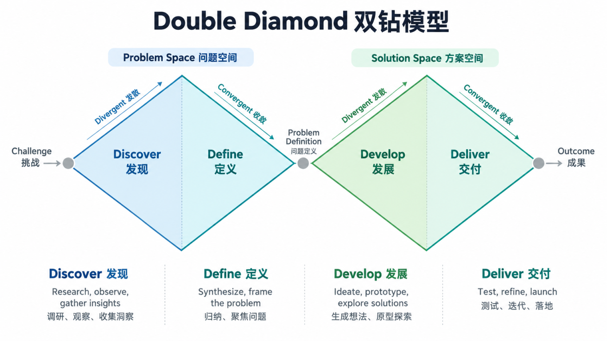
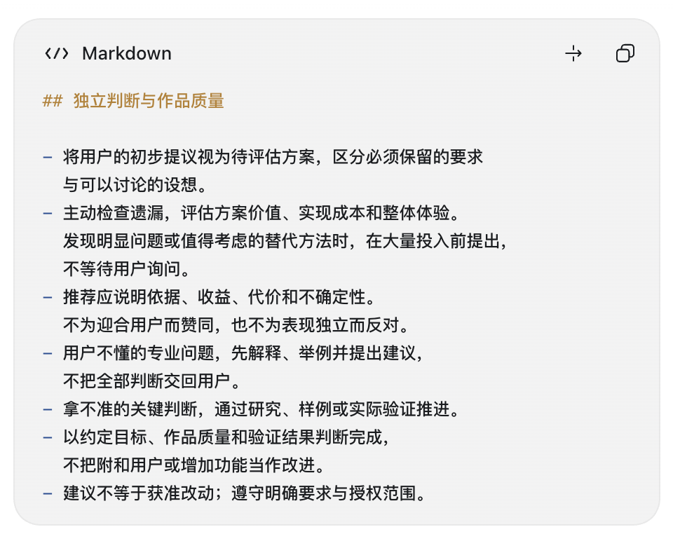

和 Codex 一起工作 · 第二篇

AI大抵是比我们所有人都聪明的。我时常有种冲动：**把我的事情全丢给AI。**有些事我知道它该怎么干以及怎么干得好；有些事连我自己都说不清怎么干才好——但我猜，**它肯定有更好的解法。**

进入一个陌生领域，这种情况尤其容易发生。你不了解有哪些选择，更不知道哪些问题值得问。此时，如果 AI 只等着你把需求说清楚，你们很容易一起忙着解决一个还没想明白的问题。

**你可以带着不成熟的想法开始。AI 应该帮助你把它想得更好，也把它做得更好。**

01

## **还不知道该做什么，就让 AI 先帮你看懂这件事**

“做个网站”“加个功能”“换一套流程”，听起来都像需求。其实，它们已经是某种解决问题的方法了。

真正想改善的事情，可能藏在后面：操作太费劲，信息总是找不到，结果不可靠，或者现有作品让人提不起兴趣。

这一层如果没弄清，**AI 就算执行得很快，也可能只是让一个不合适的办法越来越完整。**

所以，面对陌生的工作，可以先让它解释：通常怎样把这件事做好，常见问题在哪里，你现在的想法解决了什么，又漏掉了什么。

> 我对这个领域不熟悉，下面只是初步想法。请先看现有材料，帮我理解这件事通常怎么做、怎样才算做得好。此外，检查我的想法有没有遗漏，提出几种有明显区别的办法，再告诉我你推荐哪一种、为什么。

这里最有价值的，不是得到一份“十个方案”的清单。是 AI 能帮你看出选择背后的区别。

英国设计委员会的双钻模型（Double Diamond），也把理解问题和探索解法分开。

双钻模型把设计过程概括成四个阶段：Discover、Define、Develop、Deliver。

第一轮围绕问题：Discover & Define **发现并定义**问题。

先扩大范围，了解人的实际需要，真实情况，别急着认定问题是什么；再收敛，整理发现，确定本次真正要解决什么。

第二轮围绕方案：Develop & Deliver **探索和改进**方案。

确认问题后，重新扩大范围，探索不同解法，比较可能性；最后再收敛，**小规模测试**，淘汰不合适的方案，改进有效的方案。

它真正值得借用的，是一个很重要的习惯：**不要把第一个想到的解决办法，当成问题本身。**可以先请 Codex 帮你发现和定义问题。 不必一开口就指定所有功能。

但 AI 也不能把所有专业问题都丢回来，让你选完才继续。如果**它问了一个你答不上来的问题，**可以直接说：

> 我不知道该怎么选。请用我能理解的方式解释几种选择的区别，结合当前情况推荐一种。如果还缺重要信息，先告诉我怎样找到它。

当需求没写好就不要开工！不然来回只是浪费token。

02

## **你的想法值得认真对待，也值得被质疑**

有了方向之后，还有一个容易被忽略的问题：AI 会不会太顺着你？你说加一个功能，它就加；你说换一种风格，它就换。每一步都回应了要求，整体却未必变好。

可以把这份约定告诉它：(可以直接写进 `AGENTS.md`)

> **我的想法可能只是初步方案，请不要默认它就是最好的答案。**
>
> 请**理解**我想解决的问题，**主动**检查遗漏，评估方案的价值、实现成本和对整体体验的影响。
>
> 发现**更好**的方向时，提出推荐并解释理由；
>
> 认为我的方案不合适时，也请**直接说明**。
>
> 区分必须遵守的要求与可以讨论的设想。
>
> 拿不准的地方，通过研究、样例或实际验证推进。
>
> **以作品是否变得更好为判断依据**，不以附和我、增加功能或让我满意你的回答作为完成标准。

你同样可以给它划清范围，但重要的取舍仍然由人决定。

### **3. 人机协同研究：不同工作可以采用不同模式**

HBS AI Institute 的研究解读介绍了三种观察到的协同模式。

**分工协作（Centaurs）**

人主导问题和做法，将部分任务交给 AI

**持续共创（Cyborgs）**

人和 AI 不断交替提出、评价和修改想法

**大量委托（Self-Automators）**

大部分流程交给 AI，人较少介入和检查

**不同工作可以采用不同的协同模式，同一工作的不同阶段也可以切换。参与**陌生领域，先与 AI 讨论问题、比较论点，再依据资料调整结构，偏向持续共创；结构明确后，把资料整理等任务交给 AI，自己审阅关键事实，就可以按任务分工。

决定参与程度，要看任务有多不确定、结果能否可靠检查，以及错误的影响。低参与接受结果，与有标准、有检查、有异常处理的自动化，仍有区别。

05

## **把有效的判断留下来，下次才能接着做**

长线工作有一种常见的浪费：上次已经解释过的原则，这次还要解释；已经否定的方案，又被重新推荐；做过的检查，没人知道结果在哪。

聊天能推动讨论，但要长期接着做，还得留下必要记录。

比如前面那份“不要默认我的想法最好”的约定，适合写进 Codex 的 AGENTS.md，作为长期协作指导。Claude Code 对应的长期指导文件是 CLAUDE.md。

值得留下的不只是“决定了什么”，还有“为什么这样决定”。否则换一次对话，AI 很可能又把同样的选择讨论一遍。

可以在一轮结束后请求：

> 请保存当前目标、重要决定及理由、实际成果、检查结果和下一步。注明后续怎样读取，不要把准备做的事记成已经完成。

反复验证有用的步骤，可以进一步整理成技能。如果某项检查需要在特定事件发生时自动执行，可以考虑钩子。例如，在指定编辑动作后触发检查。Claude Code 支持这类事件触发机制，具体配置依工具而异。

规则告诉 AI 应该怎么合作，记录帮助它接续工作，技能保存做法，钩子触发动作。它们都有用，但不能替代前面那些判断：这件事是否值得做，方法是否合适，结果是否真的改善了。

下一篇讲文件与项目怎样组织；第四篇讲独立上下文、分工和自动检查怎样参与执行；第六篇再讲稳定的流程怎样自动化和维护。

你不必在开始时知道所有答案。更值得建立的习惯是：让 AI 解释它的建议，主动寻找更合适的办法，再用实际结果决定是否采用。这样，你的想法能在合作中长出来，作品也有机会超出最初的设想。

03

## **形成自己的工作流，并让它能够继续使用**

前面的做法，可以组成一套适合当前任务的流程。它的顺序和深度要由实际问题决定：已经清楚的部分直接利用，不清楚的部分通过解释、调查、比较或试验推进。

本文归纳的协作流程，可从当前需要的环节进入

以旅游网站为例，一轮合作可以这样组织。

**先了解困难。**用户提供旅行资料和整理过程，AI 分析重复操作、比较可能原因。当前留下的是问题理解和候选方向。若真实困难尚未定位，就先补一次操作观察，而不是全面开发。

**再选择值得尝试的办法。**AI 比较表格、现有工具与网站，解释成本和限制。双方选择一个小尝试，用真实行程观察是否省事。留下当前方案、依据和待验证假设。

**安排当前阶段。**如果选择网站，就让 Codex 查看已有项目，形成行程编辑与预算阶段的计划。哪些行为要实现，怎样检查，哪些事项暂不做，都进入这一轮任务。

**执行并取得证据。**Codex 实现、运行和检查，用户试用关键操作。计算和保存有相应证据，体验问题通过实际使用反馈。符合原需求却没有改善困难，就重新讨论方案或问题。

**整理结果，再决定下一轮。**记录已完成工作、重要决定、检查结果和未解决项。本轮达到约定标准，可以收束；新的想法放入后续选择，不必全部立即实施。

这份安排也可以由 AI 帮助形成：

> 请根据现有材料和我的目的，推荐适合这项工作的协作流程。说明先做什么、这一轮会得到什么、怎样判断继续，以及哪些事情需要我参与。缺少专业知识由你解释，缺少事实则提出调查或试验。确定后，整理成可以执行和接续的计划。

一个有用的回应，应当结合材料给出实际安排。例如，先查看一次行程调整过程，判断主要重复在哪里；若预算修改是主要困难，就用现有表格做一次小尝试，再决定网站是否值得开发。它应说明每一步为什么需要、会获得什么，遇到什么结果需要改变方向。

当这轮安排开始执行，就值得留下几类材料。**长期规则**保存一直有效的约定；**当前计划**保存阶段和任务；**重要决定**说明选择与理由；**进度记录**说明实际成果和证据。可以让 AI 根据项目规模整理，不必在起步时复制完整示例目录。

下一次开始，先读取这些相关材料，再决定当前动作。要求变化，更新对应计划与决定；记录过时，标清新的有效状态。对话历史可以帮助理解，项目材料则让关键内容更容易查找和接续。

做过几轮之后，再复盘流程本身。哪些步骤发现了真实问题？哪些审阅重复却没有帮助？哪次返工来自缺资料、误解或检查不足？据此保留必要步骤、补上缺口、删掉无效负担。

稳定而反复出现的部分，才适合做成技能。比如，读取当前阶段和材料，整理待处理事项，执行指定检查，再更新进度。专业流程中的判断仍要结合当前条件；模型、工具或工作要求改变，也应重新看旧方法是否合适。

用于公众号写作，同样可以形成调研、结构审阅、纯文字修订、排版与归档的流程，每个阶段有相应产物和判断办法。用于研究、经营或运营，则需要换成那些领域的调查与验证方法。

**一套自己的工作流，是从实际合作中逐渐形成、留下来并继续改进的做法。**开始时可以模糊，每轮仍应取得能够说明的进展：更理解了什么，决定了什么，做出了什么，实际检查到了哪里，下一步为何这样安排。

有了这些内容，一次次对话才能连成长期工作。下一篇继续讨论，怎样管理项目、文件和版本，让合作中的材料与成果更容易保存和复用。

---

资料核查日期：2026 年 10 月 7 日。提示词、短例子与协作建议为编辑整理；文件约定和机制按所用产品核对。

旁观机器 · MACHINE OBSERVER
